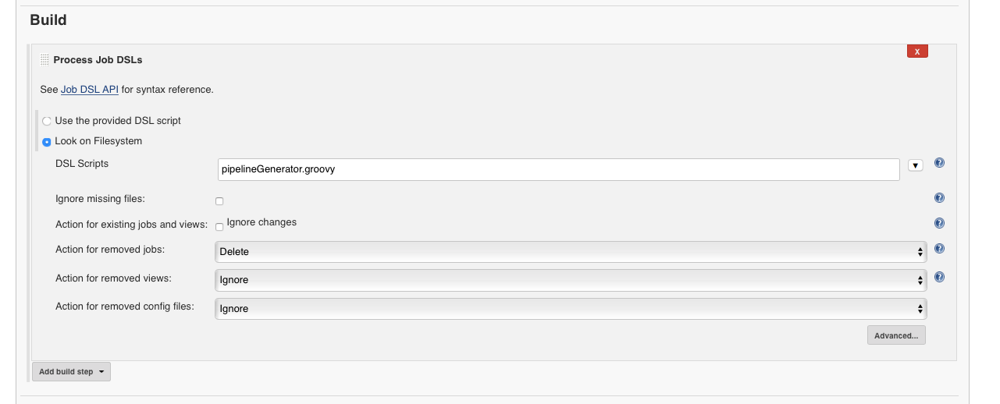

# pipeline-manager

This repo manages pipelines for an organization.

### Prerequisites
* Bitbucket Organization Plugin
* Projects setup in bitbucket
* Jenkins Job DSL plugin installed

## Pipeline Definitions as code

Pipelines can now be written as code, but something is needed to manage the pipeline references. This repo can be used to organize all your bitbucket projects in jenkins and set up all the shared-library references.

## Usage
1. Fork this repo into your organization.
2. Edit the config file to use the name of the credentialId that jenkins uses to access bitbucket.
3. Specify url to your bitbucket instance.
4. List out the urls to the shared library references.
5. Under "gitProjects", list out the names of each bitbucket project that should be checked for repos with jenkinsfiles.  
6. Push changes up to your repository and configure your "manager job"

### Manager job configuration

## Power moves
1. Used with https://github.com/liatrio/pipeline-developer, you can verify that everything is working as expected locally.
